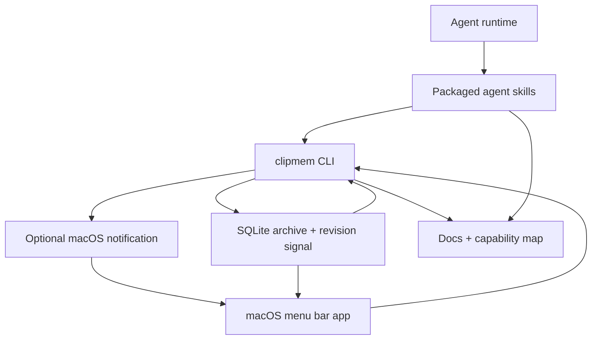
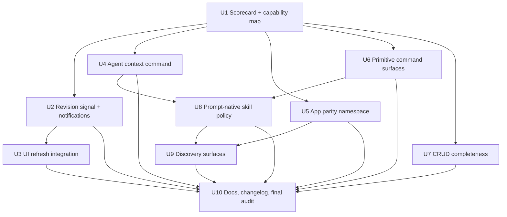

# feat: Reach full agent-native architecture coverage

## Summary

Bring clipmem from a strong agent-friendly CLI to a fully agent-native product by closing the eight audit gaps: app-only action parity, workflow-heavy tool surfaces, pull-only context, partial CRUD, non-reactive UI integration, incomplete discovery, and hardcoded recall policy. The plan keeps the shared SQLite archive and JSON-first CLI as the source of truth while adding missing primitives, context, notifications, app preference controls, documentation, and verification.

---

## Problem Frame

The agent-native audit scored clipmem at 72% overall: excellent shared workspace, action parity, and prompt-native behavior, but weaker UI integration, context injection, CRUD completeness, primitive tool design, and in-app capability discovery. The project already has the right foundation: the macOS menu bar app shells out to the same CLI agents use, packaged skills are tested for parity, and the SQLite archive is local-first. The remaining work is to make every agent-visible action complete, discoverable, reactive, and testable without splitting storage or compromising clipboard history integrity.

---

## Assumptions

*This plan was authored from the audit findings without a separate brainstorm document. The items below are agent inferences that should be reviewed before implementation proceeds.*

- The target is a follow-up audit that can reasonably score every principle at 100%, not a generic expansion of clipmem into an embedded chat app.
- It is acceptable to add advanced archive maintenance commands for strict CRUD parity as long as normal captured clipboard content remains immutable by default and dangerous operations require explicit, documented commands.
- Where the menu bar app exposes a user action, the plan should prefer an agent-addressable command over a documented exception. Exceptions are reserved for derived/internal stores or platform actions that cannot be safely automated.
- It is acceptable to keep existing human-friendly workflow commands such as `recall`, `setup`, `ocr run`, and `storage optimize-images` if lower-level primitives are also exposed and documented for agents.
- It is acceptable to add macOS-app-specific CLI commands under an `app` namespace even though they operate on app preferences rather than the SQLite archive.
- Dynamic context injection will be implemented as a CLI-generated context bundle and skill preflight guidance, not as a hosted agent runtime inside clipmem.

---

## Requirements

- R1. Raise Action Parity to 100% by exposing agent-addressable commands for menu bar app preferences, launch-at-login state, update checks, and OS follow-through actions, using an app-owned bridge where the Rust CLI cannot safely perform a macOS app action directly.
- R2. Raise Tools as Primitives to 100% by making lower-level read/write/status/action primitives first-class while preserving existing convenience workflows for human ergonomics.
- R3. Raise Context Injection to 100% by adding a current, structured agent context command and installing guidance that tells agents when to load or refresh it.
- R4. Preserve Shared Workspace at 100% by keeping the SQLite archive, app state, agent context, and skill metadata aligned around one source of truth or clearly scoped non-archive stores.
- R5. Raise CRUD Completeness to 100% by adding missing agent-accessible operations for product entities, including narrowly scoped archive maintenance operations for capture events, snapshot metadata, OCR results, settings, and ignored apps while documenting derived/internal stores as non-entities.
- R6. Raise UI Integration to 100% by ensuring external CLI or agent mutations are reflected in already-open macOS UI surfaces through a durable revision signal and UI refresh policy.
- R7. Raise Capability Discovery to 100% by surfacing agent integration in the app, setup/docs, skills, empty states, and tested discovery surfaces.
- R8. Raise Prompt-Native Features to 100% by keeping agent judgment in skill prose or editable policy, with `recall` and other ranking behavior clearly framed as convenience rather than authoritative decision logic.
- R9. Maintain existing CLI JSON contracts, test style, local-first privacy guarantees, and menu bar app behavior while adding these surfaces.
- R10. Update product documentation, skill packages, parity tests, and `CHANGELOG.md` for every user-facing change in the implementation.

---

## Scope Boundaries

- No embedded chat UI or hosted agent runtime inside the menu bar app.
- No remote service, cloud sync, telemetry, or semantic search engine.
- No change to the default local archive path unless the user explicitly configures one.
- No weakening of symlink/path safety, API-key filtering, or local-only OCR/privacy guarantees.
- No removal of existing human-friendly commands; primitives are added alongside workflows.
- No automatic mutation of user data by agents without explicit CLI commands and documented semantics.
- No full arbitrary hotkey recorder; this plan only covers parity for the existing hotkey enabled/disabled setting.

### Deferred to Follow-Up Work

- Rich agent self-improvement or user-customizable prompt editing inside clipmem.
- Semantic/embedding search, OCR bounding boxes, OCR confidence, or image thumbnails.
- Arbitrary hotkey customization beyond the existing Option-Shift-V toggle.
- Cross-machine archive sync or multi-user shared archives.

---

## Context & Research

### Relevant Code and Patterns

- `src/cli/schema.rs` defines the clap command surface and is the natural place to add `app`, lower-level OCR/storage/service primitives, and any archive maintenance subcommands.
- `src/cli/commands/entry.rs` centralizes command dispatch and should remain the only top-level command router.
- `src/cli/output/model.rs` contains versioned JSON envelope types; new agent-facing commands should use structured output models rather than ad hoc text.
- `src/db/schema.sql` defines the durable SQLite archive tables and trigger-maintained derived caches.
- `src/db/store/*` and `src/db/read/*` provide the existing split between mutation and query behavior; new archive primitives should follow that split.
- `src/cli/commands/settings.rs`, `src/cli/commands/storage.rs`, and `src/cli/commands/ocr.rs` show the existing command-module style for read/write management commands.
- `macos/ClipmemMenuBar/ClipmemMenuBar/Services/ClipmemClient/ClipmemCommand.swift` maps UI actions to CLI invocations; new agent parity commands should be consumable here when UI refresh behavior needs to match.
- `macos/ClipmemMenuBar/ClipmemMenuBar/ViewModels/AppModel.swift` owns app refresh state, pasteboard polling, action messages, history revision, update checks, hotkey setup, launch-at-login state, and UI-only preferences.
- `macos/ClipmemMenuBar/ClipmemMenuBar/App/AppCommands.swift` defines app preference keys that currently lack CLI parity.
- `tests/cli_commands/*` provide the Rust integration test pattern for JSON contracts, settings, storage, service setup, exports, pagination, and agent package commands.
- `macos/ClipmemMenuBar/ClipmemMenuBarTests/*` provide Swift Testing patterns for command construction, app model state transitions, decoding, update checks, and command runner behavior.
- `tests/skill_parity.rs` enforces packaged skill consistency across canonical, OpenClaw, Hermes, and portable variants.

### Institutional Learnings

- `docs/solutions/performance-issues/improve-file-url-capture-storage-performance-2026-04-24.md` emphasizes keeping trigger-maintained cache changes scoped, transactional, and covered by migration tests. Any revision/change-log schema should follow this discipline and avoid expensive row-level fan-out on common capture paths.
- `CHANGELOG.md` is the release-note source of truth. Every user-facing CLI, app, docs, skill, workflow, or compatibility change from this plan needs an `Unreleased` entry.

### External References

- None used. The plan relies on established repo patterns: clap commands, rusqlite-backed storage, SwiftUI app state, ServiceManagement already present in `LoginItemController`, and packaged agent skills.

---

## Key Technical Decisions

- Keep the CLI as the agent surface rather than introducing MCP or an embedded agent server: this fits the existing JSON-first architecture and avoids duplicating storage access.
- Add a durable archive/app revision signal in SQLite and use it as the UI refresh backbone: it works across CLI, agents, watcher, and app restarts, and it avoids relying solely on macOS notifications.
- Treat macOS distributed notifications as an optional acceleration layer, not the source of truth: notifications can make UI refresh feel immediate, while SQLite revisions provide durable recovery when notifications are missed or unavailable.
- Add an `agents context` command instead of trying to mutate third-party system prompts directly: skill runtimes can pull a structured context bundle consistently.
- Introduce an `app` namespace for menu bar preferences and app-local state: this closes parity gaps without pretending app preferences are archive policy.
- Preserve workflow commands but make primitive alternatives explicit: `recall`, `setup`, `ocr run`, and `storage optimize-images` remain convenient, while agents get inspect/act primitives for deliberate loops.
- Make strict CRUD safe by separating archive fidelity from maintenance operations: normal snapshot content remains an observed clipboard record, while explicit advanced commands handle event repair, metadata, OCR row management, and documented exceptions.
- Strengthen tests at contract boundaries: every new CLI surface needs JSON tests, every new Swift command path needs command-construction and state tests, and every skill/doc change needs parity coverage.

---

## Open Questions

### Resolved During Planning

- Should clipmem add a hosted agent runtime? No. The target is agent-native CLI and skill parity, not an embedded chat product.
- Should workflow commands be removed to satisfy primitive design? No. Keep them for humans and backwards compatibility; add primitive alternatives and docs.
- Should UI refresh rely only on macOS notifications? No. Notifications are useful but non-durable; SQLite revision polling is the durable baseline.
- Should app preferences move into the archive DB? No for now. They are app-local preferences, but the CLI can read/write them through the same `UserDefaults` domain or an app-owned helper path.

### Deferred to Implementation

- Exact schema shape for the revision/change log: decide the smallest durable representation after inspecting migration helpers and trigger costs.
- Exact macOS mechanism for `clipmem app launch-at-login`: implementation may need to stay in the app process or a helper if `SMAppService` cannot be safely driven from the Rust CLI.
- Exact archive maintenance command names: preserve clarity and backwards compatibility while avoiding ambiguous destructive verbs.
- Exact recall policy externalization: decide whether a simple documented policy profile is enough or whether ranking knobs need a structured config.

---

## High-Level Technical Design

> *This illustrates the intended approach and is directional guidance for review, not implementation specification. The implementing agent should treat it as context, not code to reproduce.*

The plan adds primitives and context at the CLI layer, keeps the database as the shared workspace, and teaches both the app and agents how to observe changes. The notification path is fast but optional; the revision signal is the consistency contract.

---

## Implementation Units

- U1. **Define the agent-native scorecard and parity contract**

**Goal:** Create the source-of-truth capability map and scoring contract that makes the target 100% state explicit before adding commands.

**Requirements:** R1, R2, R3, R4, R5, R6, R7, R8

**Dependencies:** None

**Files:**
- Create: `docs/action-parity.md`
- Modify: `docs/agent-integration.md`
- Modify: `docs/architecture.md`
- Test: `tests/skill_parity.rs`
- Test: `tests/cli_commands/help_and_stats.rs`

**Approach:**
- Add a checked-in map from user actions to agent capabilities, including CLI, menu bar app, OS follow-through actions, app-only preferences, and explicit exceptions.
- Define which durable entities are mutable, which are immutable audit records, and which caches are excluded from CRUD scoring.
- Document the expected post-plan audit interpretation so future contributors know what "100%" means without guessing.
- Extend tests so the skill/docs mention the parity map, JSON-first command usage, and capability discovery entry points.

**Patterns to follow:**
- `tests/skill_parity.rs` for doc/skill surface assertions.
- `docs/agent-integration.md` for agent-oriented prose.
- `docs/architecture.md` for durable store and derived-cache descriptions.

**Test scenarios:**
- Happy path: skill parity tests fail if packaged skills omit links or references to the capability map and command reference.
- Happy path: CLI help tests confirm the root help still surfaces agent-first flow and now points to the capability/context path where appropriate.
- Edge case: derived cache and FTS tables are documented as internal, so future CRUD audits do not score them as missing product entities.
- Error path: action parity map names app-only actions that do not yet have CLI parity, making incomplete implementation visible during review.

**Verification:**
- The docs provide a reviewer-readable baseline for all eight principles before code changes land.
- No product behavior changes in this unit.

---

- U2. **Add durable archive/app revision signaling**

**Goal:** Create the shared change signal that lets the macOS app detect external CLI and agent mutations.

**Requirements:** R4, R6, R9

**Dependencies:** U1

**Files:**
- Modify: `src/db/schema.sql`
- Modify: `src/db/core.rs`
- Modify: `src/db/store.rs`
- Modify: `src/db/store/capture.rs`
- Modify: `src/db/store/settings.rs`
- Modify: `src/db/store/purge.rs`
- Modify: `src/db/store/ocr.rs`
- Modify: `src/db/store/optimize.rs`
- Modify: `src/cli/commands/archive_mutate.rs`
- Modify: `src/cli/commands/service/manage.rs`
- Modify: `src/cli/output/model.rs`
- Test: `src/db/tests/filters_and_migrations.rs`
- Test: `src/db/store/tests.rs`
- Test: `tests/cli_commands/service_setup.rs`
- Test: `tests/cli_commands/storage_and_openclaw.rs`

**Approach:**
- Add a small durable revision/change-log mechanism maintained by archive and service-affecting mutations.
- Record enough change kind information for the app to decide whether to refresh status, settings, recent/history, OCR/detail, or storage diagnostics.
- Keep revision writes inside the same transaction as database mutations when the mutation touches SQLite.
- For service-only actions that do not naturally mutate the archive, update a durable app/service state marker or expose a status revision through a command the app can poll.
- Avoid per-row trigger fan-out on common capture paths; use a single revision bump per completed logical mutation.

**Execution note:** Start with migration and transaction behavior tests before wiring every mutation site.

**Technical design:** The signal should distinguish broad categories rather than encode UI behavior. Directionally: archive content changed, settings changed, OCR changed, storage changed, service changed, app preferences changed. The app decides how to refresh for each category.

**Patterns to follow:**
- Trigger and migration discipline from `docs/solutions/performance-issues/improve-file-url-capture-storage-performance-2026-04-24.md`.
- Existing mutation modules under `src/db/store/`.
- Existing JSON report models in `src/cli/output/model.rs`.

**Test scenarios:**
- Happy path: storing a new captured snapshot increments archive revision once.
- Happy path: `settings pause`, `settings retention`, `settings ignore add/remove`, `forget`, `purge`, `ocr run`, `storage compact`, and `storage optimize-images` produce the expected revision categories.
- Edge case: failed mutations do not leave an advanced revision marker behind.
- Edge case: repeated no-op settings operations either preserve revision or document and test a deliberate no-op bump policy.
- Integration: migration of an older database adds revision storage without breaking existing snapshots, settings, FTS, or derived caches.
- Error path: if revision persistence fails, the mutating command fails rather than silently making an unobservable change.

**Verification:**
- CLI and database tests prove every externally visible mutation can be observed through one durable state mechanism.

---

- U3. **Make the menu bar app react to external mutations**

**Goal:** Use the revision signal from U2 so already-open UI surfaces update when agents or external CLI invocations change clipmem state.

**Requirements:** R1, R4, R6, R9

**Dependencies:** U2

**Files:**
- Modify: `macos/ClipmemMenuBar/ClipmemMenuBar/Services/ClipmemClient/ClipmemCommand.swift`
- Modify: `macos/ClipmemMenuBar/ClipmemMenuBar/Services/ClipmemClient/ClipmemClient.swift`
- Modify: `macos/ClipmemMenuBar/ClipmemMenuBar/ViewModels/AppModel.swift`
- Modify: `macos/ClipmemMenuBar/ClipmemMenuBar/ViewModels/HistoryModel.swift`
- Modify: `macos/ClipmemMenuBar/ClipmemMenuBar/Views/HistoryWindowView.swift`
- Modify: `macos/ClipmemMenuBar/ClipmemMenuBar/Views/MenuBarPanelView.swift`
- Test: `macos/ClipmemMenuBar/ClipmemMenuBarTests/CommandConstructionTests.swift`
- Test: `macos/ClipmemMenuBar/ClipmemMenuBarTests/HistoryModelTests.swift`
- Test: `macos/ClipmemMenuBar/ClipmemMenuBarTests/DecodingTests.swift`

**Approach:**
- Add a CLI client method for polling revision state and decoding change categories.
- Add an app-level observer that runs while the app is active and while relevant windows/popovers are visible.
- Refresh only the affected surfaces: settings for policy changes, service status for service changes, recent/history for archive changes, detail/selection when a selected snapshot disappears, and diagnostics/storage when maintenance changes.
- Keep pasteboard polling for clipboard changes; revision polling complements it for external DB/service mutations that do not change the pasteboard.
- If macOS notifications are added in U2, use them to trigger an immediate revision check rather than trusting notification payloads.

**Patterns to follow:**
- Existing `PasteboardChangeMonitor` and `RecentPreviewRefreshCoordinator` in `AppModel.swift`.
- Existing history revision behavior used after in-app purge.
- Existing Swift command-construction tests.

**Test scenarios:**
- Happy path: a simulated archive revision change causes recent preview refresh and increments `clipboardHistoryRevision`.
- Happy path: a simulated settings revision causes `settingsReport` refresh without unnecessarily reloading history.
- Happy path: a simulated service revision causes service status refresh.
- Edge case: rapid revision changes coalesce without concurrent refresh storms.
- Edge case: a selected History detail whose snapshot was externally forgotten clears or reloads into a coherent empty/not-found state.
- Error path: failed revision polling records a user-visible/recoverable state without erasing current UI content.
- Integration: existing pasteboard-change refresh still works when revision polling is also enabled.

**Verification:**
- Agents can mutate archive/settings/service state through the CLI and the open app reaches matching state without manual refresh.

---

- U4. **Add agent context injection command**

**Goal:** Provide a single structured context bundle agents can load at session start or when retrieval looks stale.

**Requirements:** R2, R3, R4, R7, R8, R9

**Dependencies:** U1, U2

**Files:**
- Modify: `src/cli/schema.rs`
- Modify: `src/cli/commands/entry.rs`
- Modify: `src/cli/commands/agents.rs`
- Create or modify: `src/cli/commands/agents/context.rs`
- Modify: `src/cli/output/model.rs`
- Modify: `src/cli/presentation.rs`
- Test: `tests/cli_commands/hermes_agents.rs`
- Test: `tests/cli_commands/storage_and_openclaw.rs`
- Test: `tests/cli_commands/help_and_stats.rs`

**Approach:**
- Add `clipmem agents context` with JSON and Markdown output.
- Compose context from existing primitives: CLI version, database path, service status, settings, recent freshness, stats, latest revision, skill install/runtime diagnostics where available, and capability summary.
- Keep the command read-only and bounded; use small limits for recent activity.
- Include enough context for agents to diagnose empty results before overclaiming "nothing found".
- Avoid embedding raw clipboard content beyond small recent previews unless explicitly requested through retrieval commands.

**Patterns to follow:**
- Existing `service status --json`, `doctor --json`, `settings show --format json`, `stats --format json`, and retrieval envelope patterns.
- Existing agent doctor commands under `src/cli/commands/agents/`.

**Test scenarios:**
- Happy path: context JSON includes schema/version metadata, DB path, service health, settings summary, revision state, and capability summary.
- Happy path: context Markdown is readable and does not include parse-only JSON noise.
- Edge case: missing service or stale watcher is represented as context rather than a command failure when the database is still readable.
- Edge case: missing OpenClaw or Hermes runtimes do not fail the entire context command.
- Error path: missing/inaccessible database reports setup-needed context consistently with existing exit-code semantics.
- Integration: context command output remains bounded even with a large archive.

**Verification:**
- Agents have one documented command that satisfies the context injection audit categories: resources, settings, recent activity, capabilities, workspace state, and health.

---

- U5. **Expose menu bar app preferences and app state through CLI**

**Goal:** Close action parity gaps for app-only settings that currently live only in SwiftUI `UserDefaults` and app services.

**Requirements:** R1, R4, R6, R7, R9

**Dependencies:** U1, U2

**Files:**
- Modify: `src/cli/schema.rs`
- Modify: `src/cli/commands/entry.rs`
- Create: `src/cli/commands/app.rs`
- Modify: `src/cli/output/model.rs`
- Modify: `macos/ClipmemMenuBar/ClipmemMenuBar/App/AppCommands.swift`
- Modify: `macos/ClipmemMenuBar/ClipmemMenuBar/Views/SettingsView.swift`
- Modify: `macos/ClipmemMenuBar/ClipmemMenuBar/Services/LoginItemController.swift`
- Modify: `macos/ClipmemMenuBar/ClipmemMenuBar/Services/UpdateChecker.swift`
- Test: `tests/cli_commands/app_commands.rs`
- Test: `macos/ClipmemMenuBar/ClipmemMenuBarTests/CommandConstructionTests.swift`
- Test: `macos/ClipmemMenuBar/ClipmemMenuBarTests/UpdateCheckerTests.swift`

**Approach:**
- Add an `app` CLI namespace for showing and updating app-local preferences: binary path override, database path override, default recent hours, default query mode, and hotkey enabled.
- Add status/read/write operations for launch-at-login and update-check state. If the Rust CLI cannot safely perform a macOS app action directly, route through a documented app-owned bridge rather than leaving the user action app-only.
- Emit app preference revision changes so the UI can refresh when agents change app settings.
- Keep archive settings (`settings pause`, retention, OCR, ignore list) separate from app UI preferences to avoid conflating capture policy with UI defaults.
- If direct `SMAppService` mutation cannot be safely driven from the CLI binary, implement a project-supported app-mediated path and update the parity map to document that bridge.

**Execution note:** Characterize existing default preference behavior in Swift tests before changing how settings are read or refreshed.

**Patterns to follow:**
- `PreferenceKey` and `UserDefaults` extensions in `AppCommands.swift`.
- `ClipmemClientConfiguration.current` for binary/database override behavior.
- Existing `UpdateCheckerTests.swift` and `LoginItemController` service boundary.

**Test scenarios:**
- Happy path: `clipmem app settings show --format json` reports defaults when no `UserDefaults` values exist.
- Happy path: setting and clearing binary/database overrides changes what the app-facing configuration reports.
- Happy path: setting default recent hours and query mode is reflected by app defaults.
- Happy path: hotkey enabled/disabled can be read and written through the app namespace.
- Edge case: invalid query mode or invalid recent hours is rejected with invalid-args semantics.
- Edge case: launch-at-login unavailable or requires-approval state is represented explicitly rather than reported as success.
- Error path: update-check network failure returns a structured error or cached state without corrupting cached update information.
- Integration: changing app preferences externally causes the running app to refresh through U3 revision handling.

**Verification:**
- The action parity audit can map every menu bar app preference and app-state action to a supported command or app-owned command bridge.

---

- U6. **Split workflow-heavy features into primitive surfaces**

**Goal:** Add lower-level primitives for service setup, environment/status, OCR, image optimization, and recall-adjacent retrieval while preserving existing workflow commands.

**Requirements:** R2, R3, R5, R7, R8, R9

**Dependencies:** U1, U4

**Files:**
- Modify: `src/cli/schema.rs`
- Modify: `src/cli/commands/service.rs`
- Modify: `src/cli/service/model.rs`
- Modify: `src/cli/service/status.rs`
- Modify: `src/cli/commands/storage.rs`
- Modify: `src/db/store/optimize.rs`
- Modify: `src/cli/commands/ocr.rs`
- Modify: `src/db/store/ocr.rs`
- Modify: `src/cli/commands/retrieval.rs`
- Modify: `src/cli/commands/retrieval/recall.rs`
- Modify: `src/cli/output/model.rs`
- Test: `tests/cli_commands/service_setup.rs`
- Test: `tests/cli_commands/storage_and_openclaw.rs`
- Test: `tests/cli_commands/recall_and_human.rs`
- Test: `tests/cli_commands/formats_and_settings.rs`

**Approach:**
- Add read-only primitive commands for environment/version/path context and service provider availability.
- Add explicit service provider/list/install/start/stop/status primitives while keeping `setup` as a macro.
- Add OCR candidate/result/run-one/retry-one primitives while keeping `ocr run` as a batch workflow.
- Add image candidate/optimize-one/mark-skip style primitives while keeping `storage optimize-images` as a batch workflow.
- Make `recall` policy and confidence outputs more inspectable, and document `search`/`recent`/`timeline`/`get` as the primitive path for agents that need judgment.
- Ensure all agent-facing commands that can reasonably return JSON support JSON.

**Patterns to follow:**
- Existing `--dry-run` and `--progress jsonl` surfaces for safe inspection before mutation.
- Existing bounded `--limit` validation.
- Existing output schema versioning and command-specific envelopes.

**Test scenarios:**
- Happy path: service provider primitives expose available providers without starting or stopping anything.
- Happy path: OCR candidate/result primitives let an agent inspect a single pending or completed OCR item.
- Happy path: OCR run-one processes only the targeted hash or snapshot and reports remaining queue state.
- Happy path: image candidate primitive lists eligible rows without mutating them.
- Happy path: image optimize-one mutates only one representation and reports savings/skips consistently.
- Edge case: empty OCR/image queues produce empty JSON arrays and success status.
- Edge case: invalid target hash, snapshot, item, or UTI returns not-found rather than generic failure.
- Error path: platform OCR unavailable reports platform error consistently with existing OCR behavior.
- Integration: existing workflow commands still call through compatible lower-level paths and preserve output behavior.

**Verification:**
- The tools-as-primitives audit can classify every agent-facing operation as primitive, with workflow commands explicitly documented as wrappers.

---

- U7. **Complete safe CRUD for durable entities**

**Goal:** Close strict CRUD gaps without corrupting the meaning of a clipboard archive.

**Requirements:** R5, R9

**Dependencies:** U1, U2, U6

**Files:**
- Modify: `src/db/schema.sql`
- Modify: `src/model/archive.rs`
- Modify: `src/db/types.rs`
- Modify: `src/db/read/snapshot.rs`
- Modify: `src/db/store/settings.rs`
- Modify: `src/db/store/ocr.rs`
- Modify: `src/db/store/purge.rs`
- Create or modify: `src/cli/commands/archive_maintenance.rs`
- Modify: `src/cli/schema.rs`
- Modify: `src/cli/commands/entry.rs`
- Modify: `src/cli/output/model.rs`
- Test: `src/db/tests/filters_and_migrations.rs`
- Test: `tests/cli_commands/archive_maintenance.rs`
- Test: `tests/cli_commands/formats_and_settings.rs`

**Approach:**
- Add `settings reset` for the singleton settings entity.
- Add `settings ignore rename` or document and test update-as-remove-plus-add if the explicit rename would add little value.
- Add OCR per-hash read and clear/delete primitives.
- Add event-level create/read/update/delete maintenance commands for capture-event metadata, with clear docs that captured representation bytes remain immutable by default.
- Add snapshot metadata or annotation update support so snapshot aggregates have an explicit update operation without rewriting captured representation bytes.
- Add an archive import/create path for explicit agent-created snapshots or annotations when a synthetic record is the intended user action; keep `capture-once` as the primary observed-clipboard create path.
- Exclude derived caches, FTS tables, and internal pending restore markers from product-entity CRUD in docs and tests.

**Execution note:** Treat this unit as data-integrity-sensitive. Add characterization tests for existing cascade/delete behavior before adding event or metadata mutation.

**Patterns to follow:**
- Existing `forget` and `purge` reports for deletion counts.
- Existing `settings show` and ignore list JSON behavior.
- Existing OCR status/run report model shapes.
- Migration discipline from prior schema changes.

**Test scenarios:**
- Happy path: `settings reset` restores default pause, retention, API-key filter, OCR, and ignore behavior as documented.
- Happy path: ignored bundle update path changes one bundle ID without leaving duplicates.
- Happy path: OCR get returns a single raw-hash result with status and text/error fields.
- Happy path: OCR clear removes or resets the targeted OCR result and updates snapshot OCR cache consistently.
- Happy path: event create attaches a new event to an existing snapshot and refreshes stats/filter caches.
- Happy path: event delete removes one capture event without deleting the snapshot when other events remain.
- Happy path: event metadata repair updates only allowed event fields and refreshes filter/stat caches.
- Edge case: deleting the last event for a snapshot either rejects with a clear error or follows a documented cascade policy.
- Edge case: derived caches are rebuilt or updated after maintenance operations.
- Error path: maintenance commands reject invalid IDs, hashes, and disallowed immutable-field edits.
- Integration: CRUD operations bump revision state so the UI sees the changes.

**Verification:**
- The CRUD audit can score product entities at full operation coverage, and derived/internal stores are documented out of the entity set rather than counted as incomplete CRUD.

---

- U8. **Make prompt-native policy explicit and testable**

**Goal:** Move agent judgment guidance into editable skill/docs policy and keep hardcoded ranking behavior from becoming the authoritative agent workflow.

**Requirements:** R2, R3, R7, R8, R9

**Dependencies:** U4, U6

**Files:**
- Modify: `skills/clipboard-memory/SKILL.md`
- Modify: `skills/clipboard-memory/references/commands.md`
- Modify: `skills/clipboard-memory/references/examples.md`
- Modify: `skills/clipboard-memory/references/json-schema.md`
- Modify: `extras/openclaw/clipboard-memory/SKILL.md`
- Modify: `extras/openclaw/clipboard-memory/references/commands.md`
- Modify: `extras/hermes/clipboard-memory/SKILL.md`
- Modify: `extras/hermes/clipboard-memory/references/commands.md`
- Modify: `extras/agent-skills/clipboard-memory/SKILL.md`
- Modify: `tests/skill_parity.rs`
- Test: `skills/clipboard-memory/evals/evals.json`

**Approach:**
- Reframe `recall` as a convenience command and make primitive composition the canonical agent loop for uncertain cases.
- Add a "Before answering" context preflight that uses U4 when a session starts, when results are empty, or when setup may be stale.
- Add explicit behavior rules for low confidence, multiple candidates, exact text, binary recovery, OS follow-through actions, and app preference actions.
- Add parity tests for critical skill behavior rules, not only command keywords.
- Keep runtime-specific skill metadata intact while ensuring shared guidance does not drift.
- If recall ranking policy becomes configurable in U6, document the policy knobs in references rather than burying them in Rust-only behavior.

**Patterns to follow:**
- Existing skill package layout and byte-identical shared references.
- Existing evals under `skills/clipboard-memory/evals/`.
- Existing `tests/skill_parity.rs` frontmatter and reference-file assertions.

**Test scenarios:**
- Happy path: parity tests fail if any skill variant omits context preflight, JSON parsing rule, low-confidence handling, exact-text rule, or primitive loop guidance.
- Happy path: evals cover a query where `recall` returns low confidence and the expected agent behavior is to present candidates rather than assert certainty.
- Happy path: examples show copying text with `pbcopy`, opening URLs, revealing files, restoring snapshots, and exporting binary data.
- Edge case: skill guidance distinguishes default archive path from app DB override context.
- Error path: troubleshooting guidance tells agents to diagnose stale watcher or sandbox path issues before saying nothing exists.

**Verification:**
- A prompt-native audit can identify agent behavior in editable prose and structured references rather than hardcoded-only CLI behavior.

---

- U9. **Add in-product capability discovery and onboarding**

**Goal:** Make agent capabilities discoverable from the menu bar app, setup/docs, empty states, and command help.

**Requirements:** R1, R7, R9, R10

**Dependencies:** U5, U8

**Files:**
- Modify: `macos/ClipmemMenuBar/ClipmemMenuBar/Views/SettingsView.swift`
- Modify: `macos/ClipmemMenuBar/ClipmemMenuBar/Views/DiagnosticsView.swift`
- Modify: `macos/ClipmemMenuBar/ClipmemMenuBar/Views/MenuBarPanelView.swift`
- Modify: `macos/ClipmemMenuBar/ClipmemMenuBar/Views/HistoryWindowView.swift`
- Modify: `macos/ClipmemMenuBar/ClipmemMenuBar/Views/QuickRecallWindowView.swift`
- Modify: `src/cli/help.rs`
- Modify: `docs/getting-started.md`
- Modify: `docs/agent-integration.md`
- Modify: `docs/menu-bar-app.md`
- Test: `tests/cli_commands/help_and_stats.rs`
- Test: `macos/ClipmemMenuBar/ClipmemMenuBarTests/MarkdownLinkActionTests.swift`
- Test: `macos/ClipmemMenuBar/ClipmemMenuBarTests/HistoryModelTests.swift`

**Approach:**
- Add an Agent Integration settings/diagnostics surface that shows install, doctor, context, and example prompt commands.
- Add empty-state guidance for stale or empty archives that points to setup health and agent context checks.
- Add short prompt examples where they help users discover "ask your agent what I copied" without making the UI feel like a marketing page.
- Update CLI help to point to agent context and capability map.
- Keep UI text concise and actionable; avoid turning every empty state into agent education.

**Patterns to follow:**
- Existing Settings tabs and diagnostics surfaces.
- Existing command-click link rendering in the menu bar app.
- Existing `ROOT_AFTER_HELP` and command after-help style in `src/cli/help.rs`.

**Test scenarios:**
- Happy path: CLI help includes context/capability discovery without breaking existing examples.
- Happy path: Settings or Diagnostics can open/copy agent install/context commands using existing copy/link action patterns.
- Happy path: empty archive/stale watcher UI surfaces mention setup/diagnostics in a way consistent with skill troubleshooting.
- Edge case: agent discovery UI is hidden or low-noise when not relevant.
- Error path: missing binary/setup states continue to show primary recovery actions before agent examples.

**Verification:**
- The capability discovery audit can find onboarding, help docs, UI hints, self-description, suggested prompts, empty-state guidance, and command/help surfaces.

---

- U10. **Update release docs and run a final agent-native audit**

**Goal:** Tie all user-facing changes together with release notes, docs, tests, and an explicit post-implementation audit checklist.

**Requirements:** R1, R2, R3, R4, R5, R6, R7, R8, R9, R10

**Dependencies:** U2, U3, U4, U5, U6, U7, U8, U9

**Files:**
- Modify: `CHANGELOG.md`
- Modify: `docs/command-reference.md`
- Modify: `docs/output-formats.md`
- Modify: `docs/privacy-and-security.md`
- Modify: `docs/troubleshooting.md`
- Modify: `docs/agent-integration.md`
- Modify: `docs/action-parity.md`
- Modify: `docs/architecture.md`
- Test: `tests/skill_parity.rs`
- Test: `tests/cli_commands.rs`
- Test: `macos/ClipmemMenuBar/ClipmemMenuBarTests/CommandConstructionTests.swift`

**Approach:**
- Add concise changelog entries under `Unreleased` for CLI commands, app integration, agent context, UI refresh, docs, and skill updates.
- Update command reference and output format docs for every new JSON surface.
- Update privacy/security docs to clarify local context generation, app preference access, and destructive maintenance commands.
- Update troubleshooting docs for stale UI, revision refresh, DB path overrides, and sandbox visibility.
- Add a final audit checklist mapping each of the eight principles to the implementation evidence and tests.

**Patterns to follow:**
- Existing `CHANGELOG.md` categories.
- Existing command reference matrix in `docs/command-reference.md`.
- Existing agent integration docs and skill package references.

**Test scenarios:**
- Happy path: skill parity tests prove all packaged variants include updated command/context/discovery references.
- Happy path: CLI command tests prove new JSON output surfaces remain parseable and bounded.
- Edge case: docs distinguish archive settings from app preferences and immutable entities from derived caches.
- Error path: destructive maintenance docs include safety warnings and recovery expectations.

**Verification:**
- A fresh ce-agent-native audit can trace every 100% score to a file, test, or documented exception.

---

## System-Wide Impact

- **Interaction graph:** The CLI remains the central entry point for agents and the menu bar app. SQLite stores archive content and revision state. Skills and docs teach agents how to use the CLI. The macOS app observes revision state and optional notifications.
- **Error propagation:** New commands should use the existing exit-code discipline: invalid args, not found, unsupported format, setup/database errors, and platform errors remain distinguishable.
- **State lifecycle risks:** Revision updates must be transactional with archive changes. UI polling must coalesce rapid changes. Destructive maintenance commands must keep derived caches coherent.
- **API surface parity:** Rust CLI schema, Swift `ClipmemCommand`, docs, skills, and tests must move together. Any CLI command consumed by the app should have command-construction and decoding tests.
- **Integration coverage:** Unit tests alone will not prove app-agent parity. Implementation should include CLI integration tests, Swift model tests, and a final manual or scripted audit pass using the capability map.
- **Unchanged invariants:** Clipboard archive content remains local, SQLite-backed, searchable, deduplicated, and JSON-first. Existing retrieval commands and output schema version behavior should remain backwards compatible unless a documented schema bump is intentionally made.

---

## Risks & Dependencies

| Risk | Likelihood | Impact | Mitigation |
|---|---:|---:|---|
| Strict CRUD commands could undermine archive trust if they rewrite captured history casually. | Medium | High | Make dangerous operations explicit maintenance commands, keep captured bytes immutable by default, document exceptions, and require targeted IDs. |
| Revision signaling could slow hot capture paths. | Medium | High | Bump revisions once per logical mutation and test high-volume capture paths against prior trigger-deferral lessons. |
| App preference CLI may be brittle if it writes the wrong `UserDefaults` domain. | Medium | Medium | Characterize defaults and domain behavior in tests; keep app preference commands narrow and reversible. |
| Launch-at-login parity may not be safely controllable from the Rust CLI. | Medium | Medium | Expose status and document platform exception if mutation must remain app-bound. |
| More commands could make help/docs overwhelming. | Medium | Medium | Separate primitive references from common workflows; keep `recall`/setup workflows prominent for humans. |
| Skill variants could drift. | Medium | High | Extend `tests/skill_parity.rs` to assert critical behavior rules and shared references. |
| Context command could leak too much clipboard content. | Low | High | Keep context bounded and metadata-heavy; require retrieval commands for full content. |
| UI refresh polling could waste resources. | Medium | Medium | Poll only while app is active/visible or at a conservative cadence, and use notifications as acceleration. |

---

## Alternative Approaches Considered

- Build an MCP server: rejected for this plan because the existing CLI is already the shared app/agent primitive, and adding a server would create a second integration surface to maintain.
- Embed a chat assistant in the menu bar app: rejected because the audit gaps are architectural parity and discoverability, not absence of a chat UI.
- Use macOS notifications only for UI refresh: rejected because notifications are not durable enough for cross-process consistency.
- Move all app preferences into the SQLite archive: rejected for now because app preferences are UI-local and already live in `UserDefaults`; CLI parity can close the audit gap without conflating them with capture policy.
- Remove workflow commands like `recall` and `setup`: rejected because they are valuable human ergonomics and backwards-compatible entry points. The agent-native fix is to add primitives and documentation, not remove convenience.

---

## Phased Delivery

### Phase 1: Audit Contract and Observability

- Land U1, U2, and U3 first. This creates the scoring baseline and fixes the largest current gap: external agent changes not reflected in UI.

### Phase 2: Agent Context and Parity Surfaces

- Land U4 and U5. Agents get current context, and app-only preferences become addressable.

### Phase 3: Primitive and CRUD Completion

- Land U6 and U7. This is the highest-risk data/API phase and should proceed with focused tests and review.

### Phase 4: Skills, Discovery, and Final Audit

- Land U8, U9, and U10. Update packaged skills, UI/docs discovery, changelog, and rerun the scorecard.

---

## Documentation / Operational Notes

- `CHANGELOG.md` must be updated in the same implementation turn as every user-facing command, app, docs, skill, workflow, or compatibility change.
- `docs/command-reference.md` should remain the exhaustive CLI reference; `docs/agent-integration.md` should remain the agent workflow entry point.
- `docs/action-parity.md` should become the maintained audit artifact and should be linked from skills and integration docs.
- New destructive archive maintenance commands need clear warnings in help text and docs.
- New context output must document what it includes and what it deliberately omits for privacy.

---

## Success Metrics

- A repeated agent-native audit scores every principle at 100% using checked-in evidence.
- Every user-visible app action has a CLI/agent mapping or app-owned command bridge.
- Every agent-facing command has JSON output when agents need structured parsing.
- External `clipmem` mutations are visible in an already-open menu bar app without manual refresh.
- The packaged canonical, OpenClaw, Hermes, and portable skills stay synchronized on commands, context, examples, and behavior rules.
- New data/schema changes have migration tests and do not regress capture/storage performance.

---

## Sources & References

- Agent-native audit summary from this session.
- Related code: `src/cli/schema.rs`
- Related code: `src/cli/commands/entry.rs`
- Related code: `src/cli/output/model.rs`
- Related code: `src/db/schema.sql`
- Related code: `src/db/store/capture.rs`
- Related code: `src/cli/commands/settings.rs`
- Related code: `src/cli/commands/storage.rs`
- Related code: `src/cli/commands/ocr.rs`
- Related code: `macos/ClipmemMenuBar/ClipmemMenuBar/ViewModels/AppModel.swift`
- Related code: `macos/ClipmemMenuBar/ClipmemMenuBar/App/AppCommands.swift`
- Related code: `macos/ClipmemMenuBar/ClipmemMenuBar/Services/ClipmemClient/ClipmemCommand.swift`
- Related code: `macos/ClipmemMenuBar/ClipmemMenuBar/Services/LoginItemController.swift`
- Related tests: `tests/cli_commands/`
- Related tests: `macos/ClipmemMenuBar/ClipmemMenuBarTests/`
- Related tests: `tests/skill_parity.rs`
- Institutional learning: `docs/solutions/performance-issues/improve-file-url-capture-storage-performance-2026-04-24.md`
