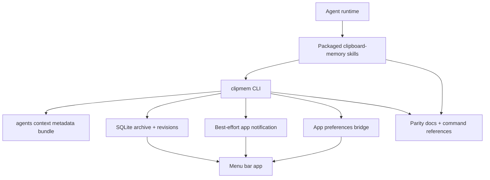
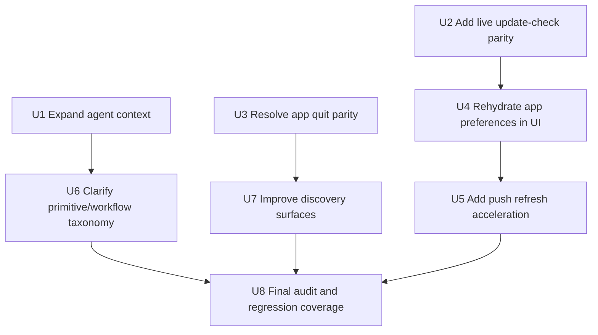

# feat: Close remaining agent-native audit gaps

## Summary

Finish the follow-up work surfaced by the second agent-native audit: expand agent context, close the remaining app-local action parity holes, make externally changed app preferences reliably refresh in the open menu bar UI, and clarify the primitive-versus-workflow command contract. The work builds on the committed parity foundation rather than replacing it.

---

## Problem Frame

The first agent-native completeness pass added the core architecture: action parity docs, durable revision counters, agent context, app preference bridges, primitive inspection commands, CRUD coverage, packaged skill updates, and macOS revision polling. The rerun audit now scores clipmem at roughly 86-88% overall. The remaining issues are narrower but still important for a defensible 100% audit: `agents context` is incomplete, two app-local UI actions lack a true agent path, open UI state only partially rehydrates external app preference changes, discovery is mostly docs-led, and workflow-shaped commands need clearer labeling.

---

## Assumptions

*This plan was authored from the fresh audit findings without a separate brainstorm document. The items below are agent inferences that should be reviewed before implementation proceeds.*

- The target is to remove the concrete gaps from the second audit, not to add new product areas beyond agent-native parity.
- Live update checking should become an agent-accessible CLI action because the menu bar UI already performs the same network-backed outcome.
- Quitting the menu bar app can be satisfied either by a first-class command bridge or by an explicit non-scored classification if direct app termination is judged unsafe during implementation.
- Existing workflow-shaped commands should remain for human ergonomics and backward compatibility; the plan should clarify their classification instead of removing them.
- Push notifications should accelerate UI refresh but should not replace the SQLite revision signal as the durable cross-process source of truth.

---

## Requirements

- R1. Raise Context Injection from 4.5/7 toward 100% by expanding `clipmem agents context --format json` with app-local preferences, bounded recent activity metadata, complete capability discovery, runtime timestamps, and privacy guidance.
- R2. Raise Action Parity from 40/42 toward 100% by adding a live app update-check command and resolving the menu bar app quit action as either agent-addressable or explicitly non-scored.
- R3. Raise UI Integration from 7/10 toward 100% by ensuring external app preference changes rehydrate and apply to already-open macOS UI surfaces.
- R4. Preserve Shared Workspace by keeping SQLite archive revisions as the durable refresh source while handling app-local preferences and DB path overrides without split-brain behavior.
- R5. Improve Tools as Primitives by separating true primitives from convenience workflows in docs and skill references without removing existing workflow commands.
- R6. Improve Capability Discovery by making in-app agent discovery and empty-state guidance reflect the fuller command surface.
- R7. Add focused tests for every new CLI contract, Swift command construction path, UI refresh behavior, documentation parity rule, and skill package reference.
- R8. Update `CHANGELOG.md`, `docs/action-parity.md`, packaged skill references, and relevant app docs for every user-facing change.

---

## Scope Boundaries

- No embedded chat UI, hosted agent runtime, MCP server, or background agent scheduler.
- No removal or behavioral breakage of existing commands such as `recall`, `setup`, `watch`, `doctor`, `ocr run`, or `storage optimize-images`.
- No raw clipboard content inside `agents context`; context additions should remain metadata-first unless the user explicitly runs retrieval commands.
- No automatic data deletion or destructive workflow expansion beyond documented parity and maintenance operations.
- No broad redesign of the menu bar app settings architecture unless required to make external preference refresh reliable.
- No cross-machine sync, telemetry, account system, or cloud update service.

### Deferred to Follow-Up Work

- A dedicated `clipmem revision --json` or `clipmem app status --json` endpoint may be useful to reduce the cost of polling full service status, but it is not required if the existing status path can remain efficient enough.
- More granular OCR or image-optimization one-record primitives can be planned separately if workflow-vs-primitive scoring remains strict after documentation clarifies the command taxonomy.
- Rich first-run onboarding for all product capabilities can follow after the targeted agent discovery improvements land.

---

## Context & Research

### Relevant Code and Patterns

- `docs/action-parity.md` is the source-of-truth parity contract and currently overstates coverage for live update checking and some workflow/format examples.
- `src/cli/schema.rs` defines the `app`, `agents`, `settings`, `ocr`, `storage`, and service command surfaces. New CLI actions should extend this schema and validation style.
- `src/cli/commands/app.rs` already reads/writes menu bar app preferences, launch-at-login desired state, and cached update-check state through the app domain.
- `src/cli/commands/agents/context.rs` already returns service health, capture settings, archive stats, revision counters, and a capability summary.
- `src/db/store/revision.rs` and mutation sites in `src/db/store/*`, `src/cli/service/manage.rs`, and `src/cli/commands/app.rs` provide the durable revision model that should remain the consistency backbone.
- `macos/ClipmemMenuBar/ClipmemMenuBar/ViewModels/AppModel.swift` owns revision polling, app preference refresh, update checks, service actions, and action messages.
- `macos/ClipmemMenuBar/ClipmemMenuBar/App/ClipmemMenuBarApp.swift` owns hotkey configuration through `@AppStorage`, which is currently not explicitly re-applied by `refreshAppPreferences()`.
- `macos/ClipmemMenuBar/ClipmemMenuBar/Services/UpdateChecker.swift` contains the app-side GitHub latest-release lookup and install-command semantics that the CLI update-check run command should mirror.
- `macos/ClipmemMenuBar/ClipmemMenuBar/Views/DiagnosticsView.swift` already has a small Agent Integration group and is the natural place to expose richer discovery actions.
- `tests/cli_commands/app_commands.rs`, `tests/cli_commands/service_setup.rs`, `tests/cli_commands/pagination_and_exports.rs`, and `tests/skill_parity.rs` show the existing integration-test style for app commands, agent context, command docs, and packaged skill parity.
- `macos/ClipmemMenuBar/ClipmemMenuBarTests/CommandConstructionTests.swift`, `DecodingTests.swift`, and app model tests are the Swift-side contract locations for new commands and refresh behavior.

### Institutional Learnings

- `CHANGELOG.md` must be updated in the same turn for user-facing CLI, docs, app, workflow, packaging, or compatibility changes.
- `docs/solutions/performance-issues/improve-file-url-capture-storage-performance-2026-04-24.md` reinforces keeping SQLite/cache updates scoped and tested. Any extra context stats should avoid expensive per-call scans or unbounded content inspection.

### External References

- None. The work is driven by the repo's audit findings and local patterns. If implementation chooses to duplicate the Swift update checker in Rust, implementation may need to consult current GitHub Releases API behavior, but the plan does not depend on external research.

---

## Key Technical Decisions

- Expand `agents context` as a metadata bundle, not a content bundle: agents should learn state, capabilities, freshness, and privacy posture without receiving raw clipboard payloads by default.
- Keep app preferences app-local but make them context-visible and UI-refreshable: `clipmem app ...` remains the bridge, while revision handling makes open app surfaces react to external changes.
- Implement live update checking in the CLI only if it can reuse the same semantics as `UpdateChecker`: latest stable GitHub release, timeout/error reporting, cache update, install command, and app preference revision bump.
- Treat app quit as an explicit parity decision: prefer a safe first-class command bridge if feasible; otherwise document it as a non-scored UI lifecycle affordance with a test enforcing the classification.
- Add push acceleration as best-effort: mutating CLI commands may notify the app immediately, but missed notifications must be harmless because revision polling remains authoritative.
- Document command taxonomy honestly: primitive commands enable direct read/list/get/set/delete/start/stop actions; convenience workflows remain available but should not be counted as primitive proof.

---

## Open Questions

### Resolved During Planning

- Should the follow-up rewrite the first plan? No. The first plan is complete and committed; this should be a new follow-up plan that targets the second audit findings.
- Should `recall` be removed to satisfy tools-as-primitives? No. It should remain a convenience ranking workflow and be documented as such.
- Should `agents context` include raw clipboard excerpts? No. The privacy model stays metadata-first; content retrieval remains explicit through `recall`, `search`, `recent`, `timeline`, `get`, and `export`.

### Deferred to Implementation

- Whether `clipmem app quit` can safely terminate the menu bar app from a CLI process without brittle process matching or private APIs.
- Whether live update checking should share Rust code with the app through duplicated protocol semantics or whether the CLI should own an equivalent small HTTP client.
- The exact push notification mechanism for macOS app refresh, including whether to use distributed notifications, Darwin notifications, or a no-op abstraction on unsupported platforms.
- Whether DB path override changes need a small app-preference revision store outside the archive DB to avoid missing the handoff between old and new DB paths.

---

## High-Level Technical Design

> *This illustrates the intended approach and is directional guidance for review, not implementation specification. The implementing agent should treat it as context, not code to reproduce.*

The CLI remains the shared automation surface. Context and app commands expose state to agents, SQLite revisions remain the durable refresh signal, and notification/app-preference refresh logic closes the gap between external CLI mutations and already-open UI state.

---

## Implementation Units

- U1. **Expand agent context coverage**

**Goal:** Make `clipmem agents context --format json` comprehensive enough to satisfy the context-injection audit without exposing clipboard contents by default.

**Requirements:** R1, R4, R7, R8

**Dependencies:** None

**Files:**
- Modify: `src/cli/commands/agents/context.rs`
- Modify: `src/cli/commands/app.rs`
- Modify: `src/cli/schema.rs`
- Modify: `src/cli/tests.rs`
- Modify: `docs/agent-integration.md`
- Modify: `docs/action-parity.md`
- Modify: `skills/clipboard-memory/references/commands.md`
- Modify: `extras/openclaw/clipboard-memory/references/commands.md`
- Modify: `extras/hermes/clipboard-memory/references/commands.md`
- Modify: `extras/agent-skills/clipboard-memory/references/commands.md`
- Test: `tests/cli_commands/service_setup.rs`
- Test: `tests/skill_parity.rs`

**Approach:**
- Add `generated_at` and a machine-readable privacy/content policy to the context output.
- Add an app-state section covering safe fields from `app settings show`, `app launch-at-login show`, and `app update-check show`.
- Add bounded recent activity metadata without raw clipboard content: counts over recent windows, latest capture time, top app/kind summaries, OCR availability, and stale indicators.
- Expand the capability summary so it matches the command matrix: app commands, OCR inspect/clear/candidates, service providers, storage image candidates, settings reset, setup/capture, destructive commands with dry-run availability, and skill package commands.
- Keep text output concise while making JSON the complete agent contract.

**Patterns to follow:**
- Existing `AgentContextOutput` and `AgentCapabilitySummary` in `src/cli/commands/agents/context.rs`.
- Existing app-state loaders in `src/cli/commands/app.rs`.
- Existing JSON envelope and integration-test assertions in `tests/cli_commands/service_setup.rs`.

**Test scenarios:**
- Happy path: `agents context --format json` includes generated timestamp, DB path, service state, capture settings, archive revision, archive stats, app settings, launch-at-login desired state, update-check cache, privacy policy, and the full capability matrix.
- Edge case: a missing DB still returns app preference and capability context while archive stats/revision are absent or null.
- Edge case: bounded recent activity never includes raw clipboard text, raw representation bytes, or unbounded item lists.
- Error path: unsupported output formats still fail with a clear unsupported-format error.
- Integration: packaged skill parity tests fail if command references omit the expanded context contract.

**Verification:**
- The context-injection audit can find all seven context categories or a documented reason they are intentionally excluded.

---

- U2. **Add live update-check command parity**

**Goal:** Close the gap between the menu bar app's live "Check for Updates" action and the current CLI's cached update-check show/clear commands.

**Requirements:** R2, R3, R4, R7, R8

**Dependencies:** None

**Files:**
- Modify: `src/cli/schema.rs`
- Modify: `src/cli/commands/app.rs`
- Modify: `src/cli/validate.rs`
- Modify: `src/cli/help.rs`
- Modify: `macos/ClipmemMenuBar/ClipmemMenuBar/Services/ClipmemClient/ClipmemCommand.swift`
- Modify: `macos/ClipmemMenuBar/ClipmemMenuBar/ViewModels/AppModel.swift`
- Modify: `docs/action-parity.md`
- Modify: `docs/agent-integration.md`
- Modify: `docs/menu-bar-app.md`
- Modify: `skills/clipboard-memory/references/commands.md`
- Modify: `extras/openclaw/clipboard-memory/references/commands.md`
- Modify: `extras/hermes/clipboard-memory/references/commands.md`
- Modify: `extras/agent-skills/clipboard-memory/references/commands.md`
- Test: `tests/cli_commands/app_commands.rs`
- Test: `src/cli/tests.rs`
- Test: `macos/ClipmemMenuBar/ClipmemMenuBarTests/CommandConstructionTests.swift`
- Test: `tests/skill_parity.rs`

**Approach:**
- Add `clipmem app update-check run --format json` or an equivalent subcommand that performs the same outcome as the app's update checker: fetch latest stable release, update cached app preference state, report current/latest versions, release URL, last checked time, availability, install command, and error state.
- Keep `show` as cached-state read and `clear` as cached-state delete; split "refresh latest update state" from "read cached update state" in docs.
- Bump `app_preferences_revision` when the run changes cached update state, and ensure the app refresh path sees the result.
- Make network failures explicit and non-destructive: preserve or clearly report cached state rather than silently clearing it.

**Patterns to follow:**
- `UpdateChecker.swift` for app-visible semantics.
- Existing `app_update_check_show` and `app_update_check_clear` in `src/cli/commands/app.rs`.
- Existing app command construction tests.

**Test scenarios:**
- Happy path: a mocked or injectable update-check response with a newer stable tag writes cache fields and returns JSON with `is_update_available: true`.
- Happy path: an older or equal version writes/checks state and returns `is_update_available: false`.
- Edge case: draft, prerelease, or invalid tag responses do not report a stable update.
- Error path: HTTP failure, timeout, or invalid JSON produces a clear nonzero error without corrupting existing cache state.
- Integration: command parsing accepts `app update-check run --format json`, and Swift command construction emits the same command for any app-side reuse.

**Verification:**
- The action-parity audit no longer lists live update checking as missing.

---

- U3. **Resolve menu bar app quit parity**

**Goal:** Decide and implement the audit outcome for the footer "Quit" action: either add a first-class agent path or explicitly exclude it as a non-scored app lifecycle affordance.

**Requirements:** R2, R6, R7, R8

**Dependencies:** None

**Files:**
- Modify: `docs/action-parity.md`
- Modify: `docs/agent-integration.md`
- Modify: `docs/menu-bar-app.md`
- Modify: `src/cli/schema.rs` *(if implementing a command bridge)*
- Modify: `src/cli/commands/app.rs` *(if implementing a command bridge)*
- Modify: `src/cli/validate.rs` *(if implementing a command bridge)*
- Modify: `src/cli/help.rs` *(if implementing a command bridge)*
- Modify: `macos/ClipmemMenuBar/ClipmemMenuBar/ViewModels/AppModel.swift` *(if adding app-side bridge behavior)*
- Modify: `macos/ClipmemMenuBar/ClipmemMenuBar/App/ClipmemMenuBarApp.swift` *(if adding app-side bridge behavior)*
- Test: `tests/cli_commands/app_commands.rs`
- Test: `src/cli/tests.rs`
- Test: `tests/skill_parity.rs`
- Test: `macos/ClipmemMenuBar/ClipmemMenuBarTests/CommandConstructionTests.swift` *(if command bridge is implemented)*

**Approach:**
- First evaluate feasibility of a safe app-owned quit request. Acceptable implementations should avoid brittle process matching and should not terminate unrelated apps.
- If feasible, expose `clipmem app quit --format json` or a similarly explicit command, with docs explaining that it requests the menu bar app to quit.
- If not feasible, document "Quit app" as a non-scored UI lifecycle affordance in `docs/action-parity.md`, with rationale. Add parity tests so future audits recognize the explicit classification rather than treating it as an accidental omission.

**Patterns to follow:**
- Existing `app launch-at-login` bridge wording for app-owned platform actions.
- Existing app command test style in `tests/cli_commands/app_commands.rs`.

**Test scenarios:**
- Happy path, command bridge chosen: parsing and JSON output for `app quit` report the request outcome without affecting archive state.
- Error path, command bridge chosen: unavailable app bridge returns a clear error and does not claim success.
- Documentation path, classification chosen: parity tests assert `docs/action-parity.md` names quit as non-scored and explains why.
- Integration: packaged skill references either include the command or explicitly avoid teaching quit as an agent capability.

**Verification:**
- The action-parity audit no longer lists menu bar app quit as an unresolved missing tool.

---

- U4. **Rehydrate external app preference changes in the open UI**

**Goal:** Make external `clipmem app settings ...` and `clipmem app launch-at-login ...` mutations reliably refresh and apply to already-open SwiftUI surfaces.

**Requirements:** R3, R4, R7

**Dependencies:** U2 for update-cache refresh behavior

**Files:**
- Modify: `macos/ClipmemMenuBar/ClipmemMenuBar/ViewModels/AppModel.swift`
- Modify: `macos/ClipmemMenuBar/ClipmemMenuBar/App/ClipmemMenuBarApp.swift`
- Modify: `macos/ClipmemMenuBar/ClipmemMenuBar/Views/SettingsView.swift`
- Modify: `macos/ClipmemMenuBar/ClipmemMenuBar/ViewModels/HistoryModel.swift`
- Modify: `macos/ClipmemMenuBar/ClipmemMenuBar/ViewModels/QuickRecallModel.swift`
- Modify: `macos/ClipmemMenuBar/ClipmemMenuBar/Services/ClipmemClient/ClipmemClient.swift`
- Modify: `macos/ClipmemMenuBar/ClipmemMenuBar/Models/ClipmemModels.swift`
- Test: `macos/ClipmemMenuBar/ClipmemMenuBarTests/DecodingTests.swift`
- Test: `macos/ClipmemMenuBar/ClipmemMenuBarTests/CommandConstructionTests.swift`
- Test: existing AppModel or view-model test files under `macos/ClipmemMenuBar/ClipmemMenuBarTests/`

**Approach:**
- Expand `refreshAppPreferences()` into a real reload/apply routine for binary path override, database path override, default recent hours, default query mode, hotkey enabled, launch-at-login desired state, and update cache.
- Move any state that cannot reliably refresh through `@AppStorage` alone into an app-level model path that can be explicitly updated when `app_preferences_revision` changes.
- Reconfigure the global hotkey when external hotkey state changes.
- Refresh or notify open History/Quick Recall models when default hours or query mode change, without clobbering active user edits unnecessarily.
- Treat database path override as a special transition: the app should not miss the revision edge because the revision belongs to the previous DB path.
- Update Settings local edit state such as retention text when the backing report changes and the user is not actively editing.

**Patterns to follow:**
- Existing `pollArchiveRevision()` and `refreshForRevisionChange()` category branching.
- Existing `ClipmemClient(configuration: .current)` path-resolution pattern.
- Existing Swift Testing style for model decoding and command construction.

**Test scenarios:**
- Happy path: external hotkey preference change triggers app-level reconfiguration and the visible setting reflects the new value.
- Happy path: external default recent hours/default query mode change affects newly opened history/recall surfaces and refreshes existing surfaces where safe.
- Happy path: external update-check cache change refreshes the menu bar badge/update state.
- Edge case: database path override change causes the app to refresh status from the correct path and avoids stale revision comparison against only the old DB.
- Edge case: retention field updates from refreshed settings when the user is not editing, but does not overwrite active local input mid-edit.
- Integration: `app_preferences_revision` changes call the expanded refresh routine exactly once per observed revision edge.

**Verification:**
- The UI-integration audit no longer lists external app preference changes as silent or unreliable.

---

- U5. **Add best-effort push refresh acceleration**

**Goal:** Reduce the external agent mutation visibility delay while preserving revision polling as the durable fallback.

**Requirements:** R3, R4, R7

**Dependencies:** U4

**Files:**
- Modify: `src/cli/commands/app.rs`
- Modify: `src/cli/commands/archive_mutate.rs`
- Modify: `src/cli/commands/settings.rs`
- Modify: `src/cli/commands/ocr.rs`
- Modify: `src/cli/commands/storage.rs`
- Modify: `src/cli/service/manage.rs`
- Modify: `macos/ClipmemMenuBar/ClipmemMenuBar/ViewModels/AppModel.swift`
- Create or modify: a small notification helper under `src/cli/` if needed
- Test: `tests/cli_commands/app_commands.rs`
- Test: `tests/cli_commands/storage_and_openclaw.rs`
- Test: existing AppModel tests under `macos/ClipmemMenuBar/ClipmemMenuBarTests/`

**Approach:**
- Add a small best-effort notification emission path after successful mutating commands that already bump revision counters.
- Add a menu bar app listener that schedules an immediate revision poll when a notification arrives.
- Keep notifications advisory: failures to emit or receive should not fail CLI commands and should not be required for correctness.
- Avoid adding notifications to dry-run or read-only commands.

**Patterns to follow:**
- Existing revision bump sites are the right places to trigger notification emission.
- Existing `pollArchiveRevision()` remains the only state reconciliation path.

**Test scenarios:**
- Happy path: a mutation that bumps archive/settings/OCR/storage/service/app preference revision emits a notification or calls the notification helper.
- Edge case: dry-run purge and read-only commands do not emit mutation notifications.
- Error path: notification failure is ignored or logged without changing command success semantics.
- Integration: app-side listener triggers an immediate revision poll without disabling the periodic polling fallback.

**Verification:**
- External agent mutations can refresh the open app faster than the polling interval when notifications are available, while tests still pass with notifications absent.

---

- U6. **Clarify primitive versus workflow command taxonomy**

**Goal:** Improve the tools-as-primitives audit score by making the primitive command set explicit and labeling convenience workflows honestly.

**Requirements:** R5, R7, R8

**Dependencies:** U1

**Files:**
- Modify: `docs/action-parity.md`
- Modify: `docs/agent-integration.md`
- Modify: `skills/clipboard-memory/SKILL.md`
- Modify: `skills/clipboard-memory/references/commands.md`
- Modify: `extras/openclaw/clipboard-memory/SKILL.md`
- Modify: `extras/openclaw/clipboard-memory/references/commands.md`
- Modify: `extras/hermes/clipboard-memory/SKILL.md`
- Modify: `extras/hermes/clipboard-memory/references/commands.md`
- Modify: `extras/agent-skills/clipboard-memory/SKILL.md`
- Modify: `extras/agent-skills/clipboard-memory/references/commands.md`
- Test: `tests/skill_parity.rs`

**Approach:**
- Add a dedicated "Primitive command set" section that lists read/list/get/set/delete/start/stop/status commands separately from workflows.
- Add a "Convenience workflows" section for `recall`, `setup`, `watch`, `doctor`, agent doctors, `ocr run`, and `storage optimize-images`.
- Keep prompt policy directing agents to compose primitives when confidence is low, exactness matters, or a destructive action is possible.
- Fix command examples that imply unsupported flags or ambiguous formats.
- Synchronize critical prompt rules and version metadata across canonical, OpenClaw, Hermes, and portable packages.

**Patterns to follow:**
- Existing `tests/skill_parity.rs` keyword and byte-parity checks.
- Existing shared `references/commands.md` package mirrors.

**Test scenarios:**
- Happy path: skill parity tests assert all packages describe primitive commands and convenience workflows consistently.
- Edge case: `recall` remains documented but is explicitly framed as a ranking helper rather than the authoritative source of truth.
- Error path: command reference tests or docs assertions fail if unsupported `--format json` examples are reintroduced.
- Integration: `docs/action-parity.md` scorecard and command references agree on the taxonomy.

**Verification:**
- A tools-as-primitives audit can distinguish architectural primitives from retained convenience workflows without counting documentation ambiguity as a gap.

---

- U7. **Improve in-app and docs capability discovery**

**Goal:** Close discovery gaps around onboarding, Diagnostics, empty states, and example prompts.

**Requirements:** R6, R7, R8

**Dependencies:** U1, U2, U3, U6

**Files:**
- Modify: `macos/ClipmemMenuBar/ClipmemMenuBar/Views/DiagnosticsView.swift`
- Modify: `macos/ClipmemMenuBar/ClipmemMenuBar/ViewModels/AppModel.swift`
- Modify: `macos/ClipmemMenuBar/ClipmemMenuBar/Views/HistoryWindowView.swift`
- Modify: `macos/ClipmemMenuBar/ClipmemMenuBar/Views/QuickRecallWindowView.swift`
- Modify: `macos/ClipmemMenuBar/ClipmemMenuBar/Views/SnapshotDetailView.swift`
- Modify: `docs/getting-started.md`
- Modify: `docs/menu-bar-app.md`
- Modify: `docs/agent-integration.md`
- Test: `macos/ClipmemMenuBar/ClipmemMenuBarTests/CommandConstructionTests.swift`
- Test: `tests/cli_commands/help_and_stats.rs`
- Test: `tests/skill_parity.rs`

**Approach:**
- Expand Diagnostics Agent Integration from two copy buttons into a compact checklist: context command, skill install, doctor, print-skill, example prompts, and capability map.
- Add copy helpers for OpenClaw/Hermes doctor and print-skill commands where appropriate.
- Add concise agent-aware empty-state guidance for stale/empty archive and no-results situations without turning app surfaces into documentation pages.
- Add a dedicated "Discover agent capabilities" subsection to getting-started docs.
- Keep UI copy short and operational; detailed behavior remains in docs and skills.

**Patterns to follow:**
- Existing `DiagnosticsActionButton` component and `AppModel` clipboard-copy helpers.
- Existing docs tone in `docs/agent-integration.md` and `docs/menu-bar-app.md`.

**Test scenarios:**
- Happy path: Diagnostics exposes copyable commands for context, install, doctor, print-skill, and capability discovery.
- Happy path: docs mention the same discovery flow as the app.
- Edge case: empty-state copy remains concise and does not imply archive content exists when setup is stale or empty.
- Integration: help/skill parity tests assert discovery surfaces mention `agents context`, skill install/doctor, examples, and `docs/action-parity.md`.

**Verification:**
- Capability discovery audit can mark onboarding/docs/UI hints/self-description/suggested prompts/empty states/help equivalents as covered without major caveats.

---

- U8. **Run final audit-aligned regression pass**

**Goal:** Make the follow-up auditable by adding targeted regression coverage and updating release notes/docs consistently.

**Requirements:** R1, R2, R3, R4, R5, R6, R7, R8

**Dependencies:** U1, U2, U3, U4, U5, U6, U7

**Files:**
- Modify: `CHANGELOG.md`
- Modify: `docs/action-parity.md`
- Modify: `docs/plans/2026-04-29-002-feat-close-agent-native-audit-gaps-plan.md`
- Test: `tests/cli_commands/app_commands.rs`
- Test: `tests/cli_commands/service_setup.rs`
- Test: `tests/cli_commands/help_and_stats.rs`
- Test: `tests/skill_parity.rs`
- Test: `macos/ClipmemMenuBar/ClipmemMenuBarTests/CommandConstructionTests.swift`
- Test: `macos/ClipmemMenuBar/ClipmemMenuBarTests/DecodingTests.swift`
- Test: existing AppModel/view-model tests under `macos/ClipmemMenuBar/ClipmemMenuBarTests/`

**Approach:**
- Update the changelog once the user-facing command, app, docs, and skill changes are known.
- Update `docs/action-parity.md` so the scorecard matches the actual implemented state rather than aspirational claims.
- Add audit-specific regression assertions for:
  - complete context categories,
  - live update-check parity,
  - app quit command or explicit non-scored classification,
  - app-preference revision refresh,
  - primitive/workflow taxonomy,
  - discovery surfaces.
- Rerun the agent-native audit after implementation and reconcile any remaining gap as either code, docs, tests, or explicit non-goal.

**Patterns to follow:**
- Existing integration suites under `tests/cli_commands/`.
- Existing macOS command construction and decoding tests.
- Existing skill parity test structure.

**Test scenarios:**
- Happy path: all new CLI commands parse, validate, and emit stable JSON where promised.
- Happy path: all packaged command references include the same new command and taxonomy sections.
- Edge case: audit docs do not claim `100%` for a category until tests and implemented behavior back the claim.
- Integration: final audit evidence maps every previous recommendation to an implemented fix, a test, or an explicit scope decision.

**Verification:**
- The follow-up audit report can show all eight principles at 100% or explain any remaining platform exception as intentionally non-scored with tests/docs enforcing that classification.

---

## System-Wide Impact

- **Interaction graph:** CLI mutations affect SQLite revisions, app preferences, optional notifications, packaged skills, docs, and SwiftUI model refresh. The plan keeps all state reconciliation flowing through revision polling or explicit app preference refresh routines.
- **Error propagation:** CLI update-check/network failures should surface clear nonzero errors without corrupting cached update state. Notification failures should not fail user-requested mutations.
- **State lifecycle risks:** DB path override changes can move the app away from the DB that recorded the revision; this needs explicit handling in U4.
- **API surface parity:** Every new CLI command must be represented in clap parsing, validation, help text, docs, packaged skills, and Swift command construction when the app uses it.
- **Integration coverage:** Unit tests alone will not prove parity. The plan requires CLI integration tests, Swift command/model tests, skill parity tests, and a final audit-aligned review.
- **Unchanged invariants:** Clipboard archive content remains local-first; `agents context` remains metadata-first; workflow commands remain backward compatible; SQLite revisions remain the durable source of truth.

---

## Risks & Dependencies

| Risk | Mitigation |
|---|---|
| Live update checking in Rust diverges from Swift app behavior | Mirror `UpdateChecker` semantics in docs/tests and keep JSON fields aligned with cached state. |
| App quit bridge is brittle or unsafe | Prefer explicit non-scored classification if a safe app-owned bridge is not practical. |
| Push notifications create false confidence | Keep notifications best-effort and make revision polling the only correctness mechanism. |
| Context expansion becomes expensive | Use bounded metadata and existing stats where possible; avoid raw content and unbounded scans. |
| External app preference changes clobber active UI edits | Refresh model state carefully and avoid overwriting local edit fields while the user is actively editing. |
| Documentation says 100% before behavior is actually complete | Add parity tests and final audit reconciliation before updating score claims. |

---

## Documentation / Operational Notes

- Update `CHANGELOG.md` under `Unreleased` for the new CLI commands, context payload fields, macOS app refresh behavior, discovery UI, and docs/skill changes.
- Keep `docs/action-parity.md` honest: classify every gap as covered, non-scored, or deferred, and avoid aspirational "100%" claims before implementation backs them.
- Update canonical and packaged skill command references in the same change as any CLI surface change.
- If `app update-check run` uses network access, document timeout/error behavior and privacy posture.

---

## Sources & References

- Origin plan: `docs/plans/2026-04-29-001-feat-agent-native-completeness-plan.md`
- Parity contract: `docs/action-parity.md`
- Agent integration docs: `docs/agent-integration.md`
- CLI app commands: `src/cli/commands/app.rs`
- Agent context command: `src/cli/commands/agents/context.rs`
- CLI schema: `src/cli/schema.rs`
- macOS app model: `macos/ClipmemMenuBar/ClipmemMenuBar/ViewModels/AppModel.swift`
- macOS update checker: `macos/ClipmemMenuBar/ClipmemMenuBar/Services/UpdateChecker.swift`
- macOS diagnostics: `macos/ClipmemMenuBar/ClipmemMenuBar/Views/DiagnosticsView.swift`
- Skill parity tests: `tests/skill_parity.rs`
