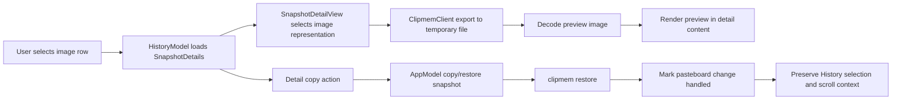

# fix: Make History images quick to preview and copy

## Summary

Fix the History detail workflow for image snapshots without turning the result list into a gallery. The plan keeps rows compact, adds an actual image preview in the selected-item detail pane, makes the primary copy action restore the saved clipboard formats, and prevents app-initiated copy from kicking History into a refresh that loses browsing context.

---

## Problem Frame

The current History view treats image snapshots mostly as placeholder text such as `[image · 148071 bytes · public.png]`. That makes image-heavy clipboard history hard to inspect, and the visible detail copy affordance is misleading because it only copies extracted text and can trigger app refresh behavior that disturbs scroll position.

---

## Requirements

- R1. Image snapshots selected in History show a real preview in the detail pane.
- R2. History rows remain compact; this plan does not add row thumbnails or gallery browsing.
- R3. The primary detail copy action for image and other non-text snapshots restores the saved clipboard snapshot with original available formats.
- R4. Plain text snapshots keep a direct plain-text copy path.
- R5. App-initiated copy/restore from History is marked as handled by the app's pasteboard monitor so it does not trigger a self-refresh loop.
- R6. Copying from the detail pane preserves the user's current History selection and browsing context.
- R7. Image placeholder strings are not presented as the main content when a real image preview is available.
- R8. Preview loading fails softly when an image representation cannot be exported or decoded.
- R9. Existing export, inspector, forget, search, recent, timeline, and restore behavior remain intact.
- R10. `CHANGELOG.md` is updated because this is a user-facing macOS app behavior change.

---

## Scope Boundaries

- No result-list thumbnails.
- No gallery mode, masonry layout, or visual browsing redesign.
- No database schema changes.
- No changes to capture, compression, OCR, search ranking, or CLI JSON output.
- No new image editing, zoom controls, crop controls, or metadata extraction.
- No changes to row identity or pagination semantics beyond preserving context during app-initiated copy.

### Deferred to Follow-Up Work

- Add row thumbnails if compact rows still make image-heavy history too hard to scan after detail preview and copy work lands.
- Add richer preview controls such as zoom-to-fit, open-in-preview, or save-as shortcuts after the basic quick-reuse path is reliable.
- Consider PDF preview parity in a separate pass if users report the same problem for PDF snapshots.

---

## Context & Research

### Relevant Code and Patterns

- `macos/ClipmemMenuBar/ClipmemMenuBar/Views/HistoryWindowView.swift` owns the split History layout, result list selection, detail column, and refresh-on-revision behavior.
- `macos/ClipmemMenuBar/ClipmemMenuBar/Views/SnapshotDetailView.swift` owns the detail content section and currently shows only best text or a no-text placeholder.
- `macos/ClipmemMenuBar/ClipmemMenuBar/Views/ItemActionButtons.swift` already exposes `Restore Snapshot`, `Copy Plain Text`, and `Export Representation` actions in the inspector.
- `macos/ClipmemMenuBar/ClipmemMenuBar/ViewModels/AppModel.swift` already has `restore(_:)`, which calls `clipmem restore`, marks the current pasteboard change as handled, and shows action feedback.
- `macos/ClipmemMenuBar/ClipmemMenuBar/ViewModels/AppModel.swift` also owns `PasteboardChangeMonitor`, whose `markCurrentChangeHandled()` method is the existing self-refresh suppression mechanism.
- `macos/ClipmemMenuBar/ClipmemMenuBar/Services/ClipmemClient/ClipmemCommand.swift` and `ClipmemClient.swift` already expose `export(snapshotID:itemIndex:uti:destination:force:)`, which can write a saved representation to a temporary file for preview.
- `macos/ClipmemMenuBar/ClipmemMenuBar/Models/ClipmemModels.swift` exposes `SnapshotDetails.items`, `ClipboardItemDetail.representations`, and `ClipboardRepresentation.kind/uti`, which are enough to choose an image representation.
- `macos/ClipmemMenuBar/ClipmemMenuBarTests/HistoryModelTests.swift`, `CommandConstructionTests.swift`, and the reactive refresh tests provide the current test style for model behavior, command construction, and pasteboard-monitor handling.

### Institutional Learnings

- `docs/solutions/performance-issues/improve-file-url-capture-storage-performance-2026-04-24.md` reinforces keeping clipboard representation work scoped and avoiding unnecessary capture/storage churn. This plan reuses existing restore/export paths instead of changing storage or capture behavior.

### External References

- No external research is needed. The repo already contains the relevant SwiftUI/AppKit interop, export, restore, and pasteboard-monitor patterns.

---

## Key Technical Decisions

- Optimize for Quick Reuse: selected image detail gets preview plus copy/restore, while the result list stays compact.
- Use `clipmem export` for previews: the app should export the selected image representation to a temporary file and decode it for display, avoiding new database or CLI response shapes.
- Use restore semantics for non-text copy: copying an image snapshot should restore the saved clipboard formats, not copy the placeholder display string.
- Centralize app-initiated pasteboard writes through `AppModel`: direct `NSPasteboard` writes in `SnapshotDetailView` bypass pasteboard-change suppression and should be replaced by model-owned actions.
- Preserve list state by suppressing self-refresh: after History initiates a copy/restore, the pasteboard monitor should treat the resulting change count as handled.
- Keep preview helper logic testable: image-representation selection and text-vs-snapshot copy policy should be separated from SwiftUI layout where practical.

---

## Open Questions

### Resolved During Planning

- Should this optimize for quick reuse or visual browsing? Quick reuse.
- Should rows show thumbnails now? No. Keep rows compact.
- Should image copy copy placeholder text? No. It should restore saved clipboard formats.
- Should this change storage, capture, or CLI output? No. Reuse existing export and restore commands.

### Deferred to Implementation

- Exact preview helper shape: choose the smallest helper or view-model seam that keeps representation selection and temporary-file cleanup testable.
- Exact temporary-file cleanup timing: remove stale preview files when the selected snapshot changes and when the view/model releases them, while accepting best-effort cleanup for app termination.
- Exact button label: choose concise text such as `Copy`, `Copy Image`, or `Restore to Clipboard` based on surrounding UI consistency during implementation.
- Exact SwiftUI preview layout constraints: tune max height and aspect fit against the existing detail column once the component is in place.

---

## High-Level Technical Design

> *This illustrates the intended approach and is directional guidance for review, not implementation specification. The implementing agent should treat it as context, not code to reproduce.*

---

## Implementation Units

- U1. **Add image preview selection and loading**

**Goal:** Let the History detail pane show an actual preview for image snapshots using saved representations.

**Requirements:** R1, R7, R8, R9

**Dependencies:** None

**Files:**
- Modify: `macos/ClipmemMenuBar/ClipmemMenuBar/Views/SnapshotDetailView.swift`
- Modify: `macos/ClipmemMenuBar/ClipmemMenuBar/Models/ClipmemModels.swift`
- Test: `macos/ClipmemMenuBar/ClipmemMenuBarTests/DecodingTests.swift`
- Test: `macos/ClipmemMenuBar/ClipmemMenuBarTests/HistoryModelTests.swift`

**Approach:**
- Add a small testable way to identify the best image representation from `SnapshotDetails.items`.
- Prefer representations whose `kind` is `image`, with UTI conformance or known public image UTIs as a fallback.
- Export the selected representation through the existing `ClipmemClient.export` command to a temporary file.
- Decode the exported file for SwiftUI display and render it above metadata in the Content section.
- Hide placeholder-only image text when an image preview is available, while preserving OCR text if OCR is present.
- Show a soft preview-unavailable state if export or decoding fails.
- Clean up temporary preview files on selection change as a best-effort lifecycle concern.

**Execution note:** Add characterization coverage for image representation selection before changing the detail view, because UI preview behavior depends on choosing the right archived representation.

**Patterns to follow:**
- Existing `Export Representation` flow in `ItemActionButtons.swift`.
- Existing detail loading pattern in `HistoryModel.swift`.
- Existing model fixture style in `DecodingTests.swift`.

**Test scenarios:**
- Happy path: an image snapshot with a `public.png` representation is selected for preview.
- Happy path: an image snapshot with multiple representations chooses an image representation instead of text metadata.
- Happy path: an image snapshot with OCR text still makes OCR text available below or alongside the preview rather than discarding it.
- Edge case: a snapshot with no image representation reports preview unavailable and falls back to existing text/no-text behavior.
- Edge case: a mixed snapshot with image plus text still previews the image without breaking text display.
- Error path: export failure produces a non-disruptive preview-unavailable state.
- Error path: exported bytes that cannot be decoded as an image produce a non-disruptive preview-unavailable state.

**Verification:**
- Selecting an image row in History shows a real image preview in the detail pane.
- Placeholder image strings no longer occupy the primary Content surface when preview is available.
- Non-image snapshots render as before.

---

- U2. **Route detail copy through snapshot-aware app actions**

**Goal:** Make the detail copy affordance copy the useful thing for the selected snapshot: plain text for text snapshots and original saved clipboard formats for image/non-text snapshots.

**Requirements:** R3, R4, R5, R6, R9

**Dependencies:** U1

**Files:**
- Modify: `macos/ClipmemMenuBar/ClipmemMenuBar/ViewModels/AppModel.swift`
- Modify: `macos/ClipmemMenuBar/ClipmemMenuBar/Views/SnapshotDetailView.swift`
- Modify: `macos/ClipmemMenuBar/ClipmemMenuBar/Views/ItemActionButtons.swift`
- Test: `macos/ClipmemMenuBar/ClipmemMenuBarTests/HistoryModelTests.swift`
- Test: `macos/ClipmemMenuBar/ClipmemMenuBarTests/CommandConstructionTests.swift`

**Approach:**
- Move detail copy behavior out of `SnapshotDetailView` direct `NSPasteboard` calls and into `AppModel`.
- Add an app-level action for copying/restoring a snapshot by ID or selected item that reuses the existing `restore` command path.
- Ensure app-initiated copy marks the pasteboard monitor's current change count as handled, matching `restore(_:)`.
- Keep a direct plain-text copy path for snapshots with meaningful text, but still mark that app-initiated pasteboard write as handled.
- Align inspector and detail copy semantics so users do not get one behavior in the main detail pane and another in the inspector.

**Execution note:** Treat this as behavior-first: write focused tests around copy-policy selection and pasteboard-change suppression before refining labels or button placement.

**Patterns to follow:**
- Existing `AppModel.restore(_:)` behavior and action-message feedback.
- Existing `PasteboardActions.copyPlainText(_:)` helper.
- Existing `CommandConstructionTests` coverage for restore/export commands.

**Test scenarios:**
- Happy path: copying an image snapshot invokes the restore command for that snapshot.
- Happy path: copying a text snapshot writes the text representation and shows success feedback.
- Happy path: app-initiated image copy marks the pasteboard change as handled so the app does not schedule its own refresh.
- Happy path: app-initiated text copy also marks the pasteboard change as handled.
- Edge case: a selected image item with no loaded detail can still use the fallback item snapshot ID for restore if appropriate.
- Edge case: a snapshot with OCR text and image data uses the selected policy intentionally rather than accidentally copying placeholder text.
- Error path: restore failure surfaces through `lastError` without clearing selection or forcing a list reload.

**Verification:**
- Clicking the detail copy action on an image puts image data back on the system clipboard.
- Clicking the detail copy action does not jump or refresh the History list because of the app's own pasteboard write.
- Existing restore and inspector actions remain usable.

---

- U3. **Preserve History browsing context during copy and refresh**

**Goal:** Ensure app-initiated copy/restore does not collapse the user's current scroll position, selection, or loaded page context.

**Requirements:** R5, R6, R9

**Dependencies:** U2

**Files:**
- Modify: `macos/ClipmemMenuBar/ClipmemMenuBar/Views/HistoryWindowView.swift`
- Modify: `macos/ClipmemMenuBar/ClipmemMenuBar/ViewModels/HistoryModel.swift`
- Test: `macos/ClipmemMenuBar/ClipmemMenuBarTests/HistoryModelTests.swift`

**Approach:**
- Audit whether History currently reloads because of `clipboardHistoryRevision`, explicit reloads, or pasteboard-monitor scheduled recent-preview refreshes after app-initiated copy.
- Preserve the selected snapshot ID and current result list when the app initiates copy/restore and the underlying archive content did not meaningfully change for the active History view.
- Avoid clearing `results` before reload unless the user explicitly changes query/mode/filter or manually refreshes.
- Keep external archive changes working: real external captures, forget actions, OCR updates, and storage changes should still refresh as they do today.
- If SwiftUI `List` still loses scroll position after harmless state changes, isolate the minimum view identity/state adjustment needed rather than changing result IDs globally.

**Patterns to follow:**
- Existing `refreshForExternalHistoryChange()` logic in `HistoryModel.swift`, which preserves selection when possible.
- Existing `SceneStorage` handling for selected item, mode, and query in `HistoryWindowView.swift`.
- Existing reactive refresh tests that cover pasteboard monitor and revision behavior.

**Test scenarios:**
- Happy path: after app-initiated image copy, the selected snapshot remains selected.
- Happy path: after app-initiated image copy, the existing results array is not cleared and rebuilt solely because of the app's pasteboard write.
- Happy path: external history changes still reload browse modes and preserve selection when the selected snapshot remains present.
- Edge case: when a selected snapshot disappears after a real forget/external change, History selects the expected fallback item.
- Edge case: loaded additional pages remain present when no real list refresh is required.
- Error path: failed copy/restore leaves results and selection unchanged.

**Verification:**
- Manual History use confirms clicking copy from a scrolled image item does not jump back to the top or lose the selected row.
- Existing external-refresh behavior remains covered by tests.

---

- U4. **Polish the quick-reuse detail UI and release note**

**Goal:** Make the fixed workflow understandable without adding a larger media browser.

**Requirements:** R1, R2, R3, R4, R7, R8, R10

**Dependencies:** U1, U2, U3

**Files:**
- Modify: `macos/ClipmemMenuBar/ClipmemMenuBar/Views/SnapshotDetailView.swift`
- Modify: `macos/ClipmemMenuBar/ClipmemMenuBar/Views/DesignSystem.swift`
- Modify: `CHANGELOG.md`

**Approach:**
- Keep the Content section visually simple: preview, primary copy action, then text/OCR when useful.
- Use a label/help text that matches what the action does for the selected snapshot.
- Avoid row thumbnail work and avoid broad redesign of the result list.
- Keep the preview bounded to the detail column so large images do not force awkward layout shifts.
- Add a concise `CHANGELOG.md` entry under `## Unreleased` / `### Fixed`.

**Patterns to follow:**
- Existing detail-section spacing and typography in `SnapshotDetailView.swift`.
- Existing action feedback overlay behavior in `HistoryWindowView.swift`.
- Existing changelog wording style under `CHANGELOG.md`.

**Test scenarios:**
- Test expectation: none for pure visual spacing and changelog wording; behavioral coverage belongs to U1-U3.
- Manual verification: image preview is visible and aspect-fit in the detail pane.
- Manual verification: text snapshots still look like the existing detail content and keep direct copy affordance.
- Manual verification: the result list remains compact and does not show thumbnails.

**Verification:**
- `CHANGELOG.md` includes the user-facing fix.
- The visible UI supports quick reuse: select image, preview image, copy image, keep browsing position.

---

## System-Wide Impact

- **Interaction graph:** History detail actions will go through `AppModel` instead of directly mutating `NSPasteboard` from `SnapshotDetailView`.
- **Error propagation:** Preview export/decode failures should remain local to the detail pane; copy/restore failures should continue through `AppModel.lastError`.
- **State lifecycle risks:** Temporary preview files need best-effort cleanup, and app-initiated pasteboard writes must not create self-refresh loops.
- **API surface parity:** CLI behavior and JSON output stay unchanged; this is macOS app behavior over existing `get`, `export`, and `restore` commands.
- **Integration coverage:** Unit tests should cover representation selection, copy policy, pasteboard-monitor suppression, and History selection preservation; manual verification should cover actual clipboard image reuse.
- **Unchanged invariants:** Search/recent/timeline results, row IDs, stored archive content, export representation behavior, and capture suppression semantics should remain compatible with current behavior.

---

## Risks & Dependencies

| Risk | Mitigation |
|------|------------|
| Preview export introduces temporary-file leaks | Keep preview exports in the temp directory, remove prior preview files on selection change, and treat cleanup as best effort. |
| Copy action label remains ambiguous | Tie label/help text to policy during UI polish, but keep the implementation behavior snapshot-aware. |
| Direct text copy still triggers self-refresh | Route plain-text copy through `AppModel` and mark pasteboard changes handled just like restore. |
| Scroll position still jumps because SwiftUI reidentifies the list | First eliminate unnecessary reloads; only then make the smallest view identity/state adjustment needed. |
| Restore creates a new capture event despite suppression | Verify against existing `restore(_:)` behavior and capture suppression tests before adding new suppression logic. |

---

## Documentation / Operational Notes

- Update `CHANGELOG.md` in the same turn as implementation, under `## Unreleased` / `### Fixed`.
- No user docs are required unless the final UI adds terminology that needs explanation.
- No migration, release flag, or service restart is required beyond rebuilding/relaunching the macOS app.

---

## Sources & References

- Related code: `macos/ClipmemMenuBar/ClipmemMenuBar/Views/HistoryWindowView.swift`
- Related code: `macos/ClipmemMenuBar/ClipmemMenuBar/Views/SnapshotDetailView.swift`
- Related code: `macos/ClipmemMenuBar/ClipmemMenuBar/Views/ItemActionButtons.swift`
- Related code: `macos/ClipmemMenuBar/ClipmemMenuBar/ViewModels/AppModel.swift`
- Related code: `macos/ClipmemMenuBar/ClipmemMenuBar/Services/ClipmemClient/ClipmemCommand.swift`
- Related code: `macos/ClipmemMenuBar/ClipmemMenuBar/Models/ClipmemModels.swift`
- Institutional learning: `docs/solutions/performance-issues/improve-file-url-capture-storage-performance-2026-04-24.md`
